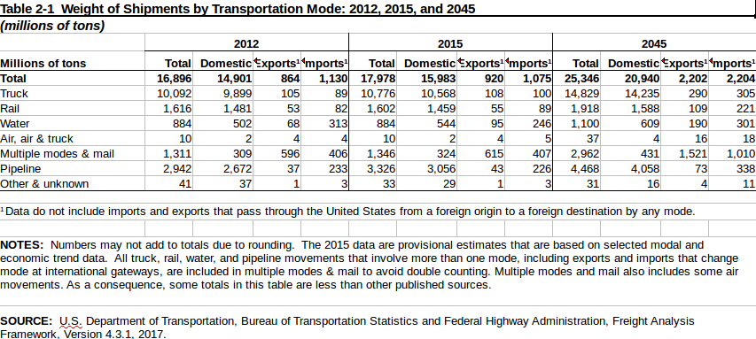

## From Web-Application to Web Framework

  The motivation behind this project is to create a new framework for calculating Land,
Sea, and Air freights in supply chain companies. Freight Forwarding is a branch in
the Supply Chain industry which has been greatly impacted by advances in tech-
nology. We see this from Amazon using KIVA system robots, to other companies
using shipping updates on packages ordered from their website. LSP Cargo Inc. is
a company which has been involved with international shipping and logistics for 20
years. This is a company which has made little to no technological advancements in its
history as an NVOCC . This gives me a great opportunity to apply my knowledge of
cargo and of software to create an application which can make a huge impact. The
way logistics works is simple but a little complicated too. I will first go into detail
on the life cycle of an order in LSP(Logistic Service Providers) Cargo Inc. and how
it differs from one of the bigger shipping companies such as FedEx or USPS.

##          Projected growth of cargo industry into 2045

  There is an ever increasing demand in supply chain at this time due to how entertwined it
is with ecommerce. Now-a-days one can order something using the internet and be surprised if it
doesn't get there within 3 days. This also fueled my motivation to accomplish this project. 
